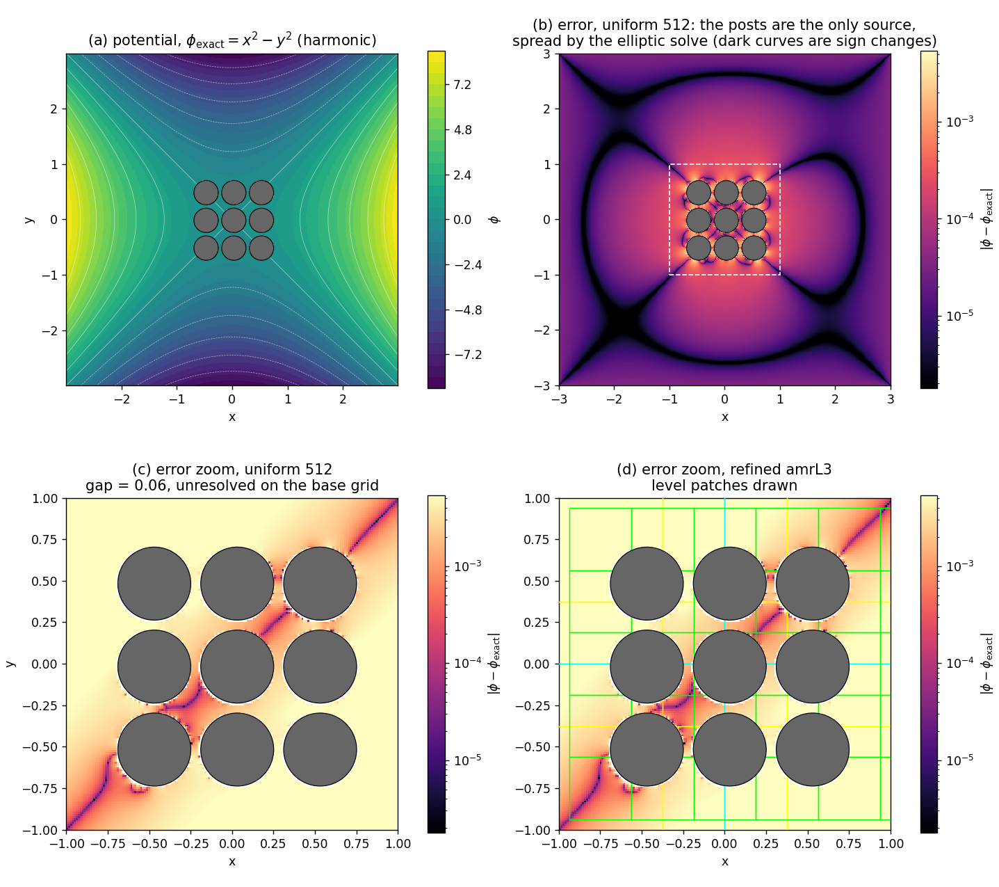

# Laplace_2D_Posts — refinement across gaps narrower than a cell

Does local refinement reproduce a uniform fine grid when the geometry has gaps
the base grid cannot see? That is the question a showerhead hole pattern or a
focus-ring gap actually asks, and this case answers it in a setting where
nothing else can contaminate the answer.

## Why this manufactured solution

`phi = x^2 - y^2` is **harmonic**, so it solves the Laplace equation the case
discretises, and its **fourth derivatives vanish**, so a second-order stencil
reproduces it exactly in the interior on any grid.

That second property is what makes the test fair. The immersed boundary becomes
the *only* source of error in the whole problem, so leaving most of the domain
on a coarse grid costs nothing by construction, and any difference between a
refined run and a uniform one is attributable to the geometry rather than to
the smoothness of the solution.

A manufactured solution with a non-zero fourth derivative cannot answer this
question. With `phi = r^4/32` (the MMS2 solution) the truncation error is
spread uniformly over the domain and is largest in the mid-field, nowhere near
the bodies; a refined run then inherits the error of its *base* grid however
many levels are added, and local refinement cannot help on any geometry. That
was measured before this case was written, which is why the solution here is
harmonic.

## Geometry

A 3x3 array of solid posts in an open `[-3,3]^2` box:

    post_r = 0.22, post_pitch = 0.50  ->  gap = 0.06

The gap is the point. On the base grid of the refined ladder (64 cells over 6
units, `dx = 0.094`) it is **0.64 of a cell** — invisible. It takes 1.3 cells at
128, 2.6 at 256, 5.1 at 512. The posts span `[-0.72,0.72]^2`, about 6% of the
domain area, so the resolution the geometry demands is needed in one small
patch while the solution itself fills the box.

The bodies are **disconnected**, which neither the annulus nor the GEC shape
exercises, and a gap this narrow puts two wall faces in a single cell — hence
`prob.corner_fallback` and `prob.perface_fallback` are on in `inputs2d`.

Unlike the annulus cases, the fluid reaches the domain box, so the box carries
the exact solution as an ordinary grid-aligned Dirichlet boundary
(`potential_bc`) and contributes no immersed-boundary error of its own.

## Running it

    make -j USE_MPI=TRUE USE_EB=TRUE
    ./run_amr_cost.sh
    python3 cost_table.py --near 1.0
    python3 contour_plot.py uni512 amrL3 laplace_2d_posts.png

Two ladders reach the same finest spacing: uniform `n = 64,128,256,512`, and
base 64 plus 1, 2, 3 levels refining cut cells plus an `n_error_buf = 8` band.
Read the table in **pairs at equal finest spacing**.

## Result

Errors inside the refined patch (`|x|,|y| <= 1`), and cost as cell updates
summed over levels and substeps — not `n^2`, because a refined run subcycles:

| finest | run | cell updates | L2 (patch) | Linf (domain) | saving |
|---|---|---|---|---|---|
| 128 | uni128 |  163840 | 5.6599e-04 | 3.1720e-03 | |
|     | amrL1  |   92160 | 5.6757e-04 | 3.1720e-03 | 1.8x |
| 256 | uni256 |  655360 | 1.7790e-04 | 1.8868e-03 | |
|     | amrL2  |  199680 | 1.7962e-04 | 1.8868e-03 | 3.3x |
| 512 | uni512 | 2621440 | 5.7898e-05 | 5.9893e-04 | |
|     | amrL3  |  481280 | 5.8788e-05 | 5.9775e-04 | 5.4x |

Errors are normalized by `max|phi_exact|` over the domain, taken **analytically**
(9 here) rather than as a max over cell centres. The discrete max is grid
dependent - the outermost cell centre of the base grid sits further from
`x = +-3` than that of a fine grid, giving 8.72 against 8.97 - and normalizing
each run by its own value injects a ~3% difference between runs that has nothing
to do with their accuracy.

Refinement reproduces the uniform grid it matches in spacing to **0.3%, 1.0%
and 1.5%** in L2, and the max norm to three or four significant figures, for
**1.8x, 3.3x and 5.4x** fewer cell updates (35x less wall time at the finest
rung, the solve being superlinear). No coarse-fine clearance warnings at any rung, so the hierarchy
keeps its distance from the wall throughout — see `vidyut.ib_cf_clearance_warn`.

The worst error sits at the same physical point in both runs, `(+0.709,+0.639)`,
0.016 from a post surface — inside a gap — found on level 3 by the refined run
and on level 0 by the uniform one, with the same value. That is the claim in one
number: the accuracy in the gap is the fine grid's, at a fraction of the cost.

## What this does not show

The **global** L2 is worse for the refined runs (1.4e-3 against 1.5e-4 at the
finest rung). The posts are the only error source, but the elliptic solve
spreads that error over the whole domain, and the resulting field is not a
quadratic, so the coarse far field carries its own truncation error in
representing it. Refinement buys accuracy where it is applied, not everywhere.

For a device calculation that is the right trade — accuracy is wanted at the
wall and in the gap, which is where the physics is — but it should be stated
rather than hidden behind a domain-wide norm.
